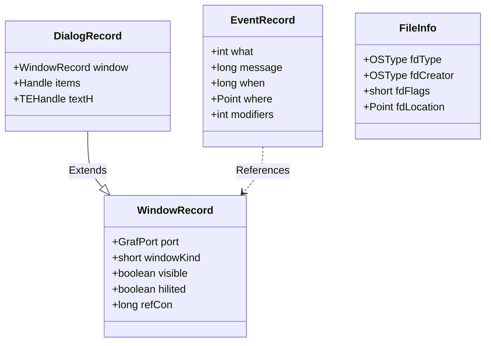

# Data Models

This document outlines key data structures and memory models used in System 7.1.

## Memory Models

### The Heap
Memory is divided into heaps.
*   **System Heap:** Persistent memory for OS and Drivers.
*   **Application Heap:** Volatile memory for the currently running application.

**Data Types:**
*   **Ptr:** A direct pointer to a block of memory.
*   **Handle:** A pointer to a master pointer. Allows the Memory Manager to move the underlying block (relocate it) to reduce fragmentation without invalidating references.

### Resources
Data is often stored in the Resource Fork of a file.
*   **Map:** Index of resources in the file.
*   **Data:** The actual binary data.
*   **Types:** 4-character codes (e.g., `'CODE'`, `'DLOG'`, `'WIND'`).

## Core Entities

### WindowRecord (`WindowPtr`)
Represents a window on the screen.
*   `port`: The graphics port (GrafPort) for drawing.
*   `windowKind`: Type of window (dialog, desk accessory, etc.).
*   `visible`: Boolean visibility flag.
*   `refCon`: Arbitrary data storage for the application.

### DialogRecord (`DialogPtr`)
Extends WindowRecord for dialog boxes.
*   `items`: Handle to the item list (controls, text).
*   `textH`: Handle to the current text edit record.

### EventRecord
Represents a user or system event.
*   `what`: Event type (mouseDown, keyDown, updateEvt).
*   `message`: Event-specific data (key code, window pointer).
*   `when`: Timestamp (ticks since boot).
*   `where`: Mouse coordinates.
*   `modifiers`: State of Shift, Cmd, Option keys.

### File System Catalog
*   **CatNode:** A node in the HFS B-Tree (File or Folder).
*   **FInfo:** File metadata (Type, Creator, location).

## Schema Diagram (Conceptual)

